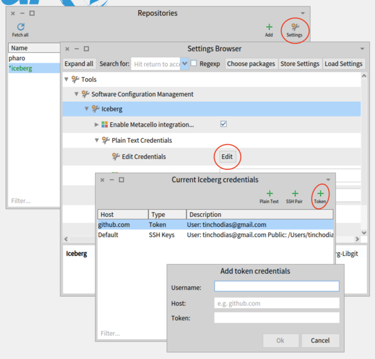

# Authentication Credentials

Iceberg performs two kinds of operations that normally require authentication:
- Git operations, such as clone, checkout, and push. 
- Extra API operations, such as accept or reject a Pull Request via GitHub Plugin (which uses their [REST API](https://developer.github.com/v3/)).

The git operation will be authenticated depending on the chosen protocol (SSH or HTTPS). For SSH, only SSH credentials can be used, but for HTTPS, you have two options: Plain-Text and Token Credentials.

The Extra API operations can't be authenticated with SSH credentials.
You need Plain-Text and Token Credentials for these.

When authentication fails in an operation, Iceberg shows a dialog asking for Plain Text Credential, which consists on username and password. But that **may not** be the credential you need. For example, you may need a Token Credentials, explained below.

## Token Credentials

Personal access tokens are an alternative to using passwords for authentication. This is important for GitHub users, since using passwords on API calls [is not supported anymore](https://developer.github.com/changes/2/#--deprecating-password-authentication). Following, we describe the steps to register for token in Iceberg.

First, create a Personal Access Token in your GitHub account. 
You can [follow this guide](https://docs.github.com/en/free-pro-team@latest/github/authenticating-to-github/creating-a-personal-access-token) to do it.
Include all "repo" and "user" permissions (scopes).
You won't be able to read the token after the webpage is closed, to paste it in a safe place.

Second, go to your Pharo image and open Iceberg -> Settings -> Edit credentials -> Add Token, as shown in the screenshot below. 
Normally, you should fill the 'Username' field with your email. 
Fill the Host field with 'github.com' to use the token for that server.



This wasn't tested on other servers, but it may work for git operations:
- [GitLab](https://docs.gitlab.com/ee/user/profile/personal_access_tokens.html)
- [BitBucket](https://confluence.atlassian.com/bitbucketserver/personal-access-tokens-939515499.html)

### Scripting

Alternatively, you can register your credential without using the GUI:

```Smalltalk
IceCredentialStore current
	storeCredential: (IceTokenCredentials new
		username: 'your@email.com';
		token: '4a01...e072';
		yourself) 
	forHostname: 'github.com'.
```

## Troubleshooting

For troubleshooting, please refer to the [README's F.A.Q. section](https://github.com/pharo-vcs/iceberg#faq), which is the curret source to handle several issues with authentication.
