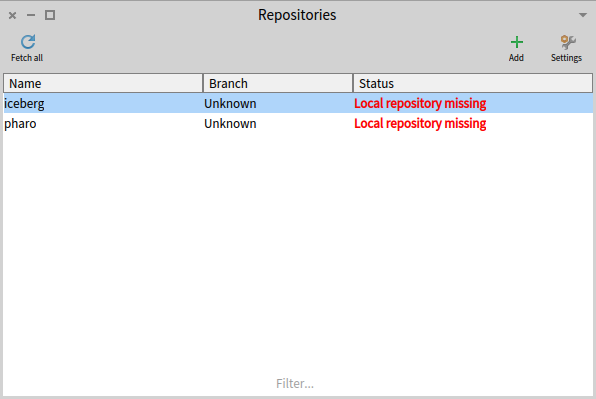
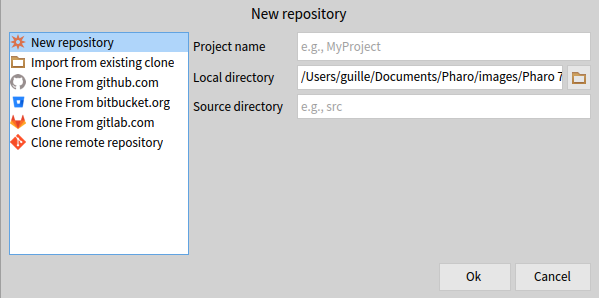
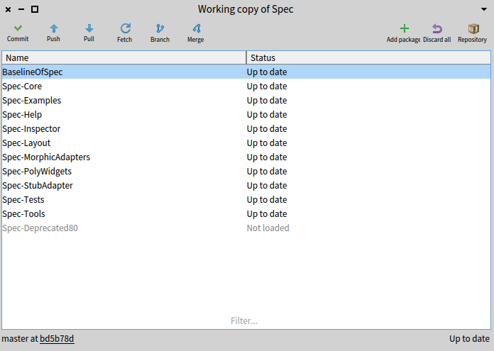
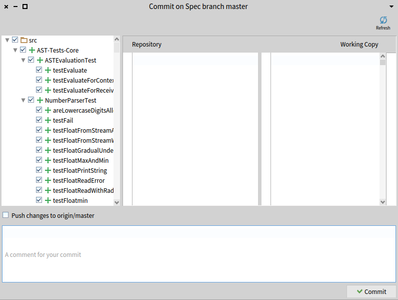
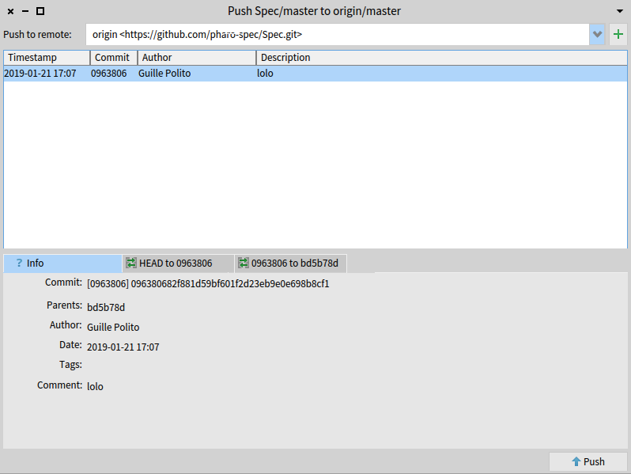
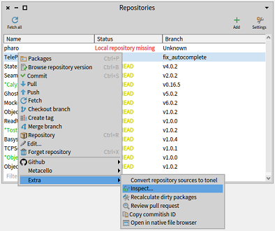
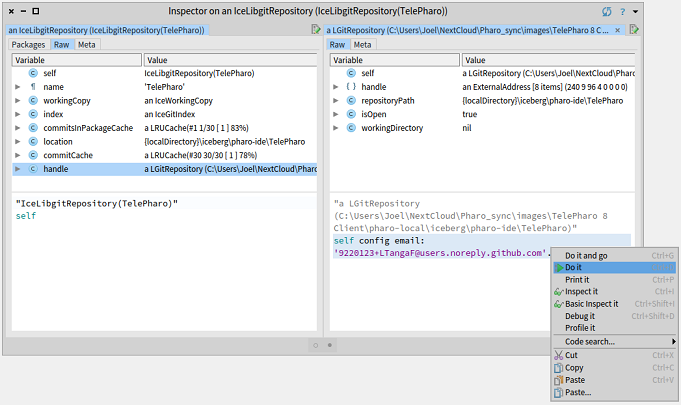

## Getting Started

This page will get you through the process of getting started with Iceberg.
We will assume some (although not a lot) knowledge on Git, but it should be fairly straight-forward.
More advanced topics like merging are not covered by this tutorial.

### Clone a repository

Before using Iceberg you should have a git repository. If you do not have one, you can *create* or *fork* one on Github.
Open the *Repositories Browser* that you can find in Pharo's menu under 'Tools' or just type 'Iceberg' in Spotter.
You will see a browser like this:

The repositories browser lists the repositories installed in your image, wheter they are bound to an existing git repository in your machine or not.
By default iceberg comes with some pre-configured repositories that help in contributing back to iceberg and pharo.

Let's add a repository, clicking on the Add button.
A dialog will ask you how what repository you want to clone and from which source:

On the left you'll be given several options to create a new repository.
On the right, a form will appear asking you for the required data to create such repository.
The existing options are:

 - New repository: create a new repository on your local machine. You will be able to work locally on it, but you will have to eventually add a remote to that repository to be able to synchronize it with remote repositories.
 - Import from existing clone: take an existing repository from your machine and read it will iceberg. You'll be able to work with that existing clone as with any other repository after that.
 - Clone from github.com/gitlab.com/bitbucket.com: clone an existing repository from one of the most known git hostings on-line. You'll have to specify the location of the repository so Iceberg will find it.
 - Clone remote repository: When none of the above suffice, and you have a git repository in some other hosting/server, this option will let you specify the clone url directly.

### Add packages to your repository

If your repository is new, you will need to add some packages to it. Just take an existing package of your own or create a Pharo package in the usual way.
Then open the working copy browser of your repository by double clicking on it or by selecting the "Packages" option in the context menu.
The working copy browser will show the list of packages in your repository, and it should be empty for a new repository.

Then you can click on the "Add package" button and select a system package to add it to your tracked packages.
The package will be added to the tracked package list and be marked as dirty (green, starred).

### Your first commit

When your repository is dirty due to some modifications in your code, you will be able to *commit* those changs in your repository.
Open the working copy browser, and click the "Commit" button to open the commit dialog:

On the left, you see a tree with all changes to the packages tracked by the repository. You can select a definition on the left and see the differences in the right panel.
On the bottom, you can specify a commit message.

Additionally, from the contextual menu of the tree, you can *revert* a change, or *browse* the changed method/class.
You can also select using the checkboxes what things you want to commit or not.

Finally, click on the 'Commit' button.

### Pulling and Pushing

When you're done with your changes, or you want to grab changes done in the remote repository, you can use the "Pull" and "Push" buttons.
Clicking on any of them will not do a pull or push immediately but show a preview first of what will happen.
Both views are really similar: they list the commits to be pulled or pushed, and you will be able to see the diffs between those commits and the current version.

Finally if you accept the dialog using the buttons "Pull" or "Push", they will take effect.

### Setting Git config values

Sometimes you may need to adjust the Git config values for your repository. For instance, to set your email address to your secure Github email address.  The procedure is currently a little buried and perhaps there will be a modal for this in the future.  You can do this from a command-line git tool outside of Pharo by going to the directory for the repo (in the `pharo-local/iceberg` directory of your image), but here is a method for doing it within Pharo.

  1. Launch __Iceberg__
  1. Right-click on the repository
  1. Choose __Extra -> Inspect...__  
     
  1. In the __Raw__ tab, select `handle` to get to the underlying __LGitRepository__ instance
  1. In the __Raw__ tab of the __LGitRepository__, access the email setter by using `self config email: '<your email address>'` and then `CMD/CTRL-d` to execute  
       
     __LGitConfig__ also exposes __username__, which is not to be confused with the Github username, but is your friendly name for commit messages, like "Joel Wilson".
